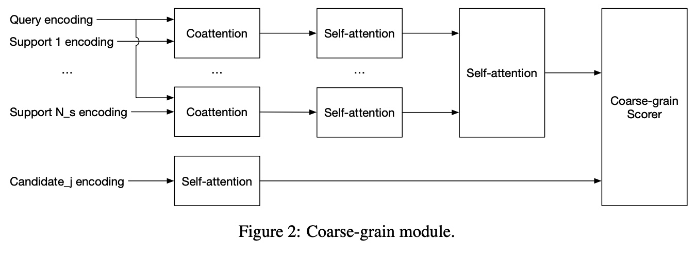

# awesome-MRC-
关于机器阅读理解有关的文章

SQuAD(Stanford Question Answering Dataset.)
这种MRC是和cloze-style rc的数据集是不同的，那种数据集的答案顶多是single word/phrase～
# 1.值得看的 Gated Self-Matching Networks for Reading Comprehension and Question Answering

# 2.Machine Reading Comprehension Using Structural Knowledge Graph-aware Network
就是MRC利用了external knowledge～之前的工作仅仅使用知识图谱比如ConceptNet作为external knowledge，然后extract triples。
## Motivation:
1.之前的方法就是ConceptNet+extract triples来做任务。但是这些方法并不能capture好对应其的structural information@知识图谱～

2.我们就是创建了一个Structural Knowledge Graph-aware Network(SKG) model, 针对MC context创建sub-graphs

# 3.Exploring Graph-Structured Passage Representation for Multi-hop Reading Comprehension with GNN
MHRC: Multi-hop Reading Comprehension task~
## Motivation
1.MHRC model has to distinguish the relevant facts from the irrelevant ones~

这里就是三个edge 的graph@针对graph，比如same/window/coref～(指代消解)

# 4.A Graph-based Relevance Matching Model for Ad-hoc Retrieval
## Motivation
1.先前的关于文本匹配的工作虽然探索了local pattern，但是并没有利用到word之间的关系～

# 5.Improving Span-based Question Answering Systems with Coarsely Labeled Data
## Motivation
1.改进coarse-grained data套路的一种方法

# 6.Coarse-Grain Fine-Grain Coattention Network for Multi-evidence Question Answering@ICLR 2019
## Motivation
1.90%的questions in SQuAD都可以使用1 sentence in a document来回答～

2.In this work, we instead focus on multi-evidence QA,回答问题需要聚合evidence from 多个文档～

**在Multi-evidence QA模型中，我们的Coarse-grain Fine-grain Coattention Network@粗粒度的推理以及细粒度的推理**

## 我们的两个module@coarse-grained/fine-grained就是每个module都有一个对应的层次attention～

这里的层次注意力的意思就是coattention+self-attention～

## Coarse-grain Module

## Fine-grain Module

Finegrained 就是单纯从每个文档和query都进行交互encoding，然后finegrain module就是对于mention进行self-attention，然后query对这些Mention进行coattn@CFC。

